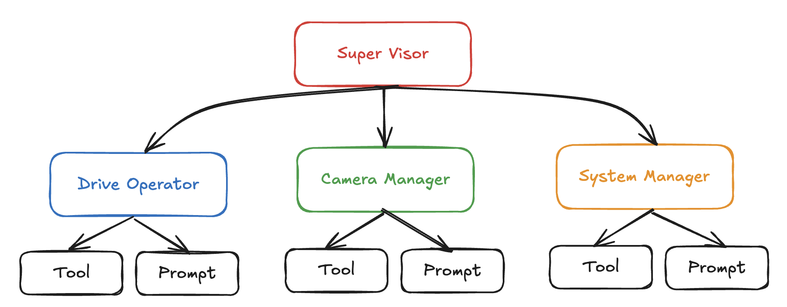
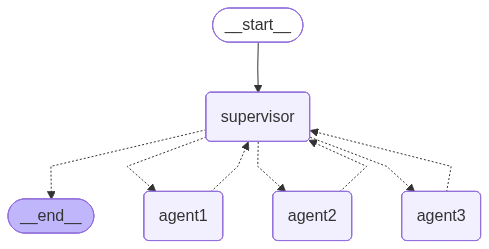
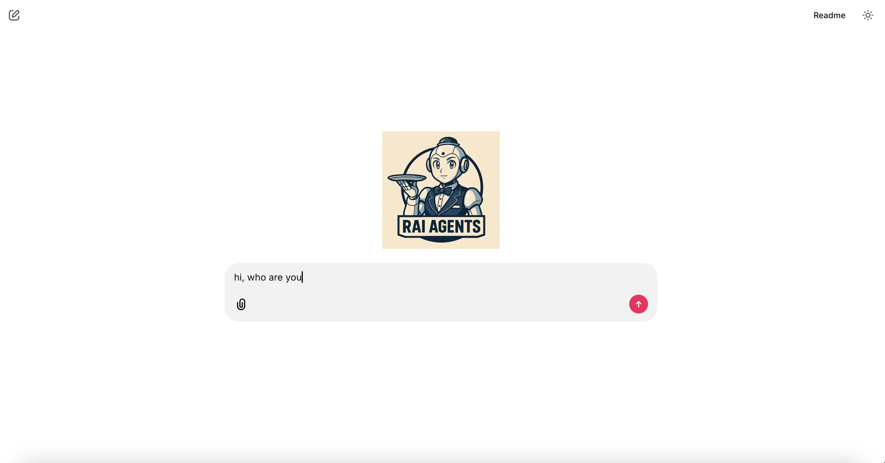

# bandu
Bandu: AI Agents based on ROS2

[](https://github.com/sachinkum0009/bandu/blob/main/LICENSE)
[](https://github.com/sachinkum0009/bandu/actions)


## Overview

It is a multi agent based application where each agent has different capabilities and tools to interact with the robot using ROS2 communication. The agents can be used to perform various tasks such as driving the robot, getting the temperature of the robot, telling jokes, etc.



## Features
- Multi-agent system with different capabilities
- Agents can interact with the robot using ROS2 communication
- Agents can use tools to perform various tasks
- Web-based UI to interact with the agents
- Built using Chainlit for easy deployment and interaction
- LLM model used: GPT-4-Turbo (can be changed in the code to use other models)

## Hierarchical Agents



## Installation steps

```bash
# use uv to install deps
uv sync

# source ros
source /opt/ros/jazzy/setup.bash # change jazzy with your ros distro

# start app
uv run chainlit run scripts/app.py --host 0.0.0.0
```

### Commands to start Manipulation and Navigation Agents

```bash
# source ros
source /opt/ros/jazzy/setup.bash # change jazzy with your ros distro
# start manipulation
uv run start_manipulation_agent

# start navigation
uv run start_navigation_agent

# manual test for a2a agents
uv run start_manipulation_agent
```

## UI



## Image Credits

Images used in this repository are downloaded from [Flaticon](https://www.flaticon.com/).
