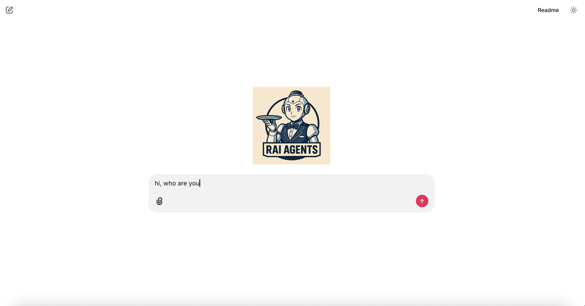

# bandu
Bandu: AI Agents based on ROS2

## Installation steps

```bash
# create a virtual env and install deps
pip install -r requirements.txt

# start app
chainlit run app.py --host 0.0.0.0
```

## UI



## Image Credits

Images used in this repository are downloaded from [Flaticon](https://www.flaticon.com/).